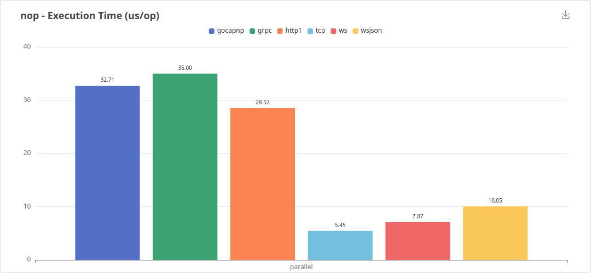
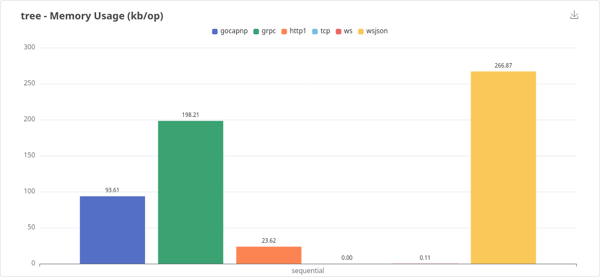
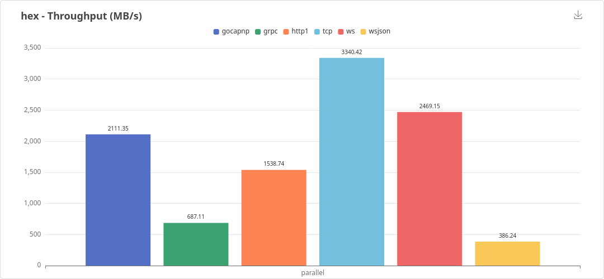

# Go RPC Benchmark

A comparative benchmark across multiple RPC systems.

Inspired by [goserbench](https://github.com/matheusd/go_serialization_benchmarks/).

# Results

A quick look at some of the most important results. Also check the [latest full results](https://matheusd.github.io/gorpcbench/www/last_benches.html):

