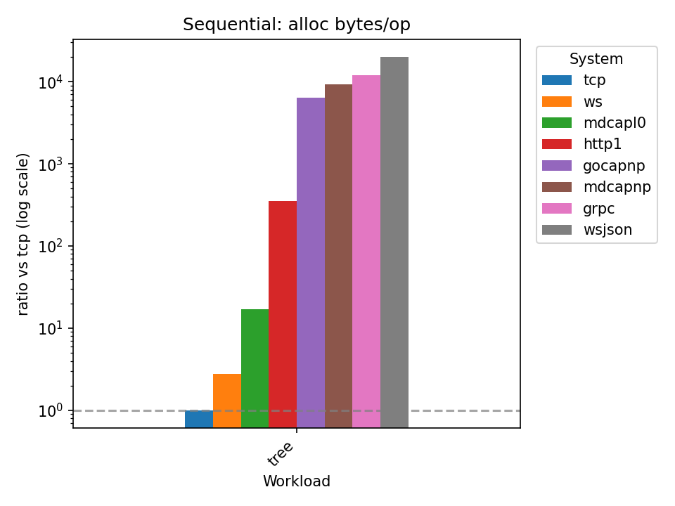

# Go RPC Benchmark

A comparative benchmark of multiple RPC systems.

Inspired by [goserbench](https://github.com/alecthomas/go_serialization_benchmarks).


# Results

A quick look at some of the most important results. Also check the [latest full results](https://matheusd.github.io/gorpcbench/www/last_benches.html),
an explanation of the [tested workloads](#test-workloads) and of the available [RPC systems](#tested-rpc-systems).

The results are a comparison against the baseline, hand-written, TCP-based RPC system.


## Call Latency Overhead


This is the time overhead of performing a single round-trip call (lower is
better).


## Average Alloc Memory Cost

The average memory cost incurred when performing a call that involves
structures of various depths (lower is better).




## Throughput for Raw Data

The average throughput when performing a call that sends raw bytes (higher is
better).


# Test Harness

Each test begins by initializing and running one server and one or more clients. 

For the "sequential" set of tests, only one client is created and every call is
made sequentially. For the "parallel" set of tests, N clients are created (depends
on the test parallelism and the environment's `runtime.NumCPU()`) and the clients
make their calls concurrently to each other.

Each RPC system under test adapts a common test harness interface (see [rpcbench/interface.go](/rpcbench/interface.go)) 
to their preferred API style, allowing the same test to be executed across a
diverse set of RPC implementations.

In the current implementation, each client creates one connection to the server
and is handled as if it was not safe for concurrent use by multiple goroutines.
While some RPC systems support multiplexing multiple calls through the same conn
(notably: gRPC), enforcing one conn per client ensures a fairer comparison.

Note that, given both server and client run on the same benchmark instance, the
test results currently mingle _both_ ends of the connection. As an example, the 
`Add` test workload will measure the time for the client to serialize the arguments,
the server to de-serialize them, process and serialize the results and then for
the client to de-serialize them back. In the future, this package may offer separate
stats for client and server.


# Test Workloads

Each test op involves sending one request and waiting for its reponse back.

**Nop**: Measures the overhead of the simplest possible call: a no-op. Clients
send an empty request and expect an empty response from the server. The goal of
this test is to build a baseline for the other tests.

**Add**: Measures the performance of a simple `Add()` call, including serializing
and de-serialiazing arguments and results. The goal for this test is to be compared
to the nop test, as a way of observing the minimum overhead involved in serialization
of calls.

**Tree**: Measure the performance of passing around a complex, tree-like data structure
with varying levels of branching and depth. The goal for this test is to infer
the overhead of serialization for arbitrarily-nested, complex data structures.

**Hex**: Measure the performance of converting an input binary stream to hex. The 
goal for this test is to estimate the maximum throughput of an RPC system, by
sending and expecting back simple blobs of data.


# Tested RPC Systems

## TCP

This is a simple, hand-written, custom RPC system running over a raw TCP
connection. This implementation should be close to the most efficient possible,
and serves as a baseline against which to measure the other systems. 

This implementation uses binary-encoded messages, and reuses buffers as best as
possible to ensure no data leaks.

Clients are **not** safe for concurrent use and **cannot** multiplex multiple calls.


## HTTP1

This is a simple, hand-written, custom RPC system running over an HTTP 1 connection.

Each call is implemented as an HTTP endpoint (e.g. `/nop`, `/add`, etc).

This uses the same custom binary encoding for messages as TCP, as it is meant to
measure the overhead of using HTTP instead of raw TCP.

While the underlying HTTP client implentation from the standard library could
allow writing a concurrent safe client, given that the current test harness already
enforces one client per test goroutine, this implementation opts to use per-client
buffers to improve performance a little bit and ensures each client maintains
a separate connection to the server.

Note that overlaying a JSON encoding for messages can only reduce performance,
so that scenario is not currently tested for this RPC.

## Websocket

This is a simple, hand-written, custom RPC system running over a websocket endpoint.

Two serialization protocols are supported: the same binary format as used in the
TCP/HTTP1 implementations and JSON-encoded messages.

## gRPC

This is a [gRPC-based](https://pkg.go.dev/google.golang.org/grpc) implementation.

As of this version, this is the most straightforward implementation, for both
client and server.

## Go-CapNProto

This is a [Go-CapNProto based](https://github.com/capnproto/go-capnp)
implementation.

> [!WARNING]
> Some configurations of the hex test make this system fail (grep for GOCAPNPHEXBUG).
> Make sure to evaluate its fitness for your use-case.


# Generating the Report

Using [task](https://taskfile.dev) as task runner and [vizb](https://github.com/goptics/vizb)
to generate the report (those need to be installed):

```shell
$ task report


# Adding New Systems

This is a rough outline of the steps necessary to adding a new RPC system to test:

- Start a new implementation in `internal/rpc/<target-system>`.
  - `<sys>_client.go` for client code, implementing `rpcbench.Client`.
  - `<sys>_server.go` for server code, implementing `rpcbench.Server`.
  - `<sys>_factory.go` for the factory object to init clients and servers.
- Add an entry to the `all_systems` var in `benches.go`.
- Describe the system in the README.

